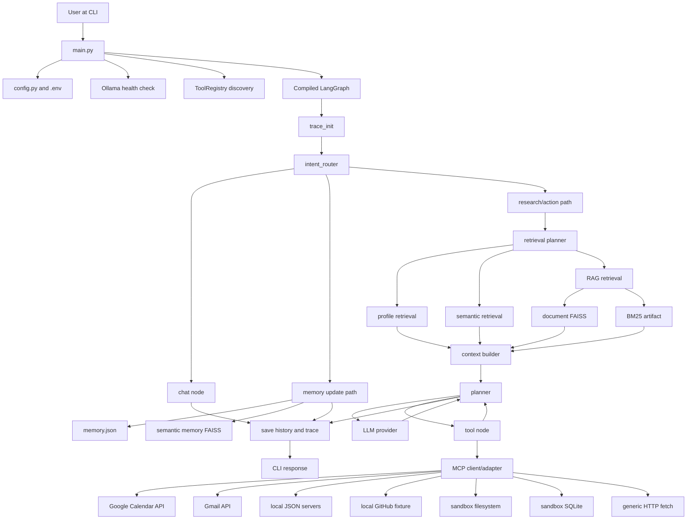

# Project Deep-Dive Interview Guide

## Project
Agentic AI Assistant (repository: `agentic-ai-assistant`)

## Purpose
A local-first command-line personal assistant that routes user requests through a LangGraph workflow. It can answer conversational requests, extract profile facts into memory, retrieve local company documents, invoke native tools, and invoke tools exposed by MCP stdio servers. Two external-service adapters are real OAuth integrations: Google Calendar and Gmail. Several other MCP servers are deterministic local backends used for development and testing.

## Architecture
The application is a synchronous Python CLI around a compiled LangGraph `StateGraph`. `main.py` loads `.env`, checks Ollama, discovers MCP tools, compiles the graph, and invokes it. The graph initializes tracing, routes the request to chat, memory update, or research/action, optionally performs retrieval, invokes planner logic, executes tools, loops when more work is needed, and persists chat history and traces. The design is production-oriented in its vocabulary (timeouts, retry, circuit breakers, confirmation, tracing), but important boundaries are still prototype-grade: no service API, no authenticated multi-user boundary, local JSON/file persistence, broad OAuth scopes, incomplete cancellation, and several test/benchmark claims that are weaker than their report wording suggests.

## Technology Stack
- Python 3.10+ intent; the current development environment has also used Python 3.14.
- LangGraph for graph orchestration and state transitions.
- LangChain core/community/provider integrations and `ToolNode`.
- Ollama through `langchain-ollama`, default model `qwen3:8b`.
- Optional provider factories for Anthropic, OpenAI, Google Gemini, and Groq; their provider packages are not all declared in `requirements.txt`.
- Hugging Face `HuggingFaceEmbeddings` with `sentence-transformers/all-MiniLM-L6-v2`.
- FAISS for dense vector indexes.
- BM25 for sparse retrieval.
- Optional RRF and cross-encoder reranking paths.
- MCP SDK over stdio for tool discovery and invocation.
- Google Calendar API v3 and Gmail API v1 with desktop OAuth.
- JSON files, SQLite, FAISS files, JSONL traces, and local sandbox files.
- `pytest` tests and custom benchmark harnesses.

## How a Request Flows Through the System

```text
User CLI input
  -> main.py
  -> Ollama availability check and MCP discovery
  -> graph.compile()
  -> trace_init_node
  -> intent_router
      -> chat_node
      -> memory_extractor_node -> memory_saver_node -> memory_response_node
      -> retrieval_planner_node
          -> memory_retriever_node and/or rag_retriever_node
          -> context_builder_node
          -> planner_node
              -> tools/tool_node
              -> planner_node again when a tool result needs interpretation
              -> save_history_node
  -> chat_history.json and JSONL trace
  -> formatted CLI answer
```

For the current Google path:

```text
User request
  -> explicit action routes to research_query
  -> MCP registry discovers google_calendar/gmail tools
  -> planner creates a plan or tool decision
  -> MCPClient starts the selected stdio server
  -> server uses OAuth token and Google API
  -> tool result returns through LangChain adapter
  -> planner summarizes or returns deterministic completion
  -> CLI prints answer
```

## Biggest Technical Decisions
1. Use LangGraph instead of a linear function chain so route-specific state and tool loops are explicit.
2. Use MCP as a normalized tool boundary so local and external tools share discovery and execution machinery.
3. Use local Ollama by default to reduce API cost and keep data local.
4. Use profile memory, semantic memory, and document retrieval as separate retrieval sources.
5. Use FAISS plus BM25 because semantic similarity and exact lexical matching solve different failure modes.
6. Use stdio MCP servers for process isolation and simple local deployment.
7. Use local JSON/SQLite stores for deterministic development and tests.
8. Use OAuth-backed Google adapters for real Calendar/Gmail access.
9. Add confirmation inference for destructive operations.
10. Add trace events, latency breakdowns, retry, timeout, and circuit-breaker scaffolding.

## Biggest Limitations
- No HTTP/API frontend; the interface is a CLI.
- No authentication, authorization, tenant isolation, or user identity boundary.
- Google credentials and refresh tokens have been stored in the workspace; treat them as compromised and rotate them.
- OAuth scopes are broad (`calendar`, Gmail read/send/modify).
- Local JSON and SQLite persistence is not concurrency-safe.
- Thread-based timeouts do not cancel the underlying operation.
- A timed-out operation may continue and perform a side effect.
- Confirmation continuation is not safely bound to a persisted plan or session.
- `mcp_github_server.py` uses a fake local store and does not use `GITHUB_TOKEN`.
- Local calendar, notes, and reminders are not external services.
- The default retrieval path does not always use the full documented RRF/reranker pipeline.
- Benchmark report wording overstates some metrics and contains contradictions.
- The planner contains service-specific exceptions despite documentation claiming generic planning.

## Interview Risk Areas
- Explaining the difference between MCP discovery and actual service integration.
- Defending why local fixture servers are not production integrations.
- Explaining timeout semantics honestly: thread timeout is not cancellation.
- Explaining why the architecture has both dependency planning and baseline ReAct-style planning.
- Explaining the actual default RAG path rather than the aspirational diagram.
- Addressing secrets in `client_secret.json` and token files.
- Describing the lack of multi-user authorization.
- Explaining why a benchmark result of 100% E2E does not prove production correctness.

# 1. Repository Map

## Top-level files

- `main.py`: production CLI entrypoint. Loads configuration, checks Ollama, discovers MCP tools, compiles graph, invokes single or interactive requests.
- `graph.py`: creates the LangGraph state machine, routing edges, tool loop, and history/trace terminal node.
- `state.py`: `AgentState` TypedDict plus reducers for messages, lists, dictionaries, and trace steps.
- `config.py`: reads `.env` and defines model, retrieval, timeout, planning, and guard settings.
- `llm.py`: provider factory and module-global `llm` instance.
- `ingest.py`: document loading/chunking/index construction.
- `reranker.py`: cross-encoder reranking model, now lazily initialized.
- `requirements.txt`: dependency declaration; it must match the selected Python version and provider configuration.
- `pytest.ini`: pytest configuration.
- `README.md`: project overview and claimed architecture; it is not authoritative when it disagrees with code.

## `nodes/`

- `router.py`: heuristic-first route selection with LLM fallback.
- `chat.py`: direct conversational LLM response.
- `memory_extractor.py`: LLM extraction of profile and semantic facts; persistence helpers are in the same file.
- `memory_retriever.py`: profile JSON retrieval and optional semantic FAISS retrieval.
- `retrieval_planner.py`: decides whether profile, semantic, or RAG sources are needed.
- `rag_retriever.py`: document retrieval using FAISS, BM25, and configured modes.
- `bm25.py`: sparse search helper.
- `rrf.py`: reciprocal rank fusion helper.
- `embeddings.py`: Hugging Face embedding singleton; expensive model initialization should happen only when semantic/RAG retrieval is needed.
- `context_builder.py`: combines retrieved contexts and time/context information.
- `planner_node.py`: baseline planner, dependency planner, hybrid routing, goal guard integration, argument repair, final-answer logic.
- `tools.py`: native calculator/web-search tools, MCP registry bootstrap, traced tool execution, retry, timeout, confirmation, and circuit breaker.

## `planning/`

- `classifier.py`: classifies complexity as `SIMPLE`, `DEPENDENT`, `MULTI_STEP`, or `UNCERTAIN` using tool-name and linguistic signals.
- `schema.py`: Pydantic `Plan` and `PlanStep` models.
- `validation.py`: validates tools, dependencies, and confirmation requirements.
- `goal_guard.py`: determines required/completed operations; currently contains hardcoded operation mappings and is not completely generic.

## `mcp_layer/`

- `models.py`: normalized tool and server configuration schemas.
- `registry.py`: server loading, discovery, name prefixing, aliases, native registration, policies, and tool map.
- `client.py`: sync wrappers around async MCP client operations and stdio/HTTP transports.
- `adapter.py`: converts MCP schemas to LangChain `StructuredTool` objects.
- `discovery.py`: optional LLM-based server/tool filtering.
- `errors.py`: MCP error types and mapping.

## `observability/`

- `ids.py`: request/trace identifiers.
- `trace.py`: event creation, append, latency, and usage helpers.
- `storage.py`: JSONL trace persistence.
- `redaction.py`: basic key-based redaction and safe serialization.
- `timeout.py`: thread-based synchronous timeout helper.
- `retry.py`: retry wrapper.
- `errors.py`: error taxonomy and payload construction.

## MCP servers

### Real external integrations
- `google_calendar_server.py`: Google Calendar API v3 using OAuth.
- `gmail_server.py`: Gmail API v1 using OAuth.

### Local deterministic backends
- `mcp_calendar_server.py`: JSON file calendar under `mcp_data/calendar.json`.
- `mcp_notes_server.py`: JSON file notes under `mcp_data/notes.json`.
- `mcp_reminders_server.py`: JSON file reminders under `mcp_data/reminders.json`.
- `mcp_github_server.py`: local fixture-like GitHub store under `mcp_data/github_store.json`; `GITHUB_TOKEN` is documented but not used.
- `mcp_sqlite_server.py`: actual local SQLite database under `mcp_sandbox/app.db`.

### Local but operational utilities
- `mcp_filesystem_server.py`: real filesystem operations restricted to `mcp_sandbox/`.
- `mcp_fetch_server.py`: real HTTP requests, but unauthenticated and vulnerable to SSRF without additional network validation.

## Data and artifacts

- `documents/`: source company-policy text files.
- `faiss_index/`: dense document index.
- `bm25_chunks.pkl`: sparse index artifact.
- `memory/memory.json`: profile facts.
- `memory/semantic_memory/`: semantic memory FAISS files.
- `memory/chat_history.json`: plaintext question/answer history.
- `mcp_data/`: local JSON server stores.
- `mcp_sandbox/`: filesystem sandbox and SQLite database.
- `traces/`: JSONL observability traces.
- `.google_token.json`, `.gmail_token.json`, `client_secret.json`: OAuth runtime artifacts. These must not be committed or exposed.

# 2. Entry Points and Configuration

## CLI entrypoint: `main.py:main`

Startup sequence:

1. Print configuration.
2. Call `verify_ollama_connectivity(LLM_MODEL)` against `/api/tags`.
3. Load MCP server configurations.
4. Discover tools using `registry.discover(force=True)`.
5. Import and compile the graph.
6. In single-query mode, join `sys.argv[1:]` and call `app.invoke({"question": query})`.
7. In interactive mode, repeatedly call `input()` and support a basic yes/no confirmation continuation.
8. Format `answer`, last message content, or a generic tool-completed fallback.

A design issue is that Ollama is checked even when a cloud LLM provider is selected. The provider-specific check should be conditional.

## Environment configuration

Important variables read by `config.py`:

- `LLM_PROVIDER`, `LLM_MODEL`, `OLLAMA_BASE_URL`.
- `TIMEOUT_LLM_S`, `TIMEOUT_TOOL_S`, `TIMEOUT_MCP_S`, `TIMEOUT_RETRIEVAL_S`.
- `MAX_RETRIES`, `MAX_TOOL_FAILURES_PER_TOOL`.
- `MAX_EXECUTION_STEPS`, `MAX_PLAN_STEPS`, `MAX_REPLANS`.
- `PLANNING_STRATEGY`, `HYBRID_LEVEL_CAP`, `HYBRID_REPLAN`.
- `RESULT_AWARE_REPLANNING`, `PLANNER_COMPLETION_CONTEXT`, `GOAL_FULFILLMENT_GUARD`.
- `MCP_ARGUMENT_REPAIR`, `MAX_ARGUMENT_REPAIR_ATTEMPTS`.
- `MCP_CONFIG_FILE`, `MCP_SERVERS`.

Google server variables:

- `GOOGLE_CLIENT_ID`, `GOOGLE_CLIENT_SECRET`.
- `GOOGLE_CREDENTIALS_FILE`.
- `GOOGLE_TOKEN_FILE`, `GMAIL_TOKEN_FILE`.

Configuration mismatch: `.env.example` historically used `OLLAMA_HOST`, while `config.py` reads `OLLAMA_BASE_URL`. The example must use the variable that the implementation actually reads.

# 3. State Model

`AgentState` is a single shared TypedDict used across all graph paths. Important groups:

- Request: `question`, `route`.
- Retrieval: `retrieval_plan`, `profile_context`, `semantic_context`, `rag_context`, `_combined_context`, `retrieved_chunks`, `retrieval_metrics`.
- Memory: `extracted_profile`, `extracted_semantic`.
- Messages/output: `messages`, `answer`.
- Execution: `current_step`, `completed_steps`, `tool_results`, `execution_status`, `tool_call_count`, `last_action`, `execution_trace`.
- Planning: `active_plan`, `plan_completed_steps`, `plan_step_results`, `pending_step_id`, `plan_replans`.
- Observability: request/trace IDs, `trace_events`, `trace_step`, `latency_breakdown`, `tool_failure_counts`, `llm_usage`, total latency.
- Safety: `required_operations`, `completed_operations`, `remaining_operations`, `goal_check_status`, `pending_confirmation`, `user_confirmed`.

Reducers:

- `add_messages` merges LangChain messages.
- `_merge_lists` concatenates lists.
- `_merge_dicts` applies right-side dictionary keys over left-side keys.
- `_max_or_last` retains the maximum numeric trace step.

Important limitation: nodes often mutate `state["trace_events"]` and also return the accumulated list while `trace_events` has a concatenating reducer. This can duplicate events during graph merges and make persisted traces misleading.

# 4. Pin-to-Pin Execution Walkthroughs

## Workflow A: Chat request

Example: `hi`.

1. `main.py` invokes the compiled graph with `{"question": "hi"}`.
2. `trace_init_node` in `graph.py` creates request and trace IDs, initializes lists, and emits `REQUEST`.
3. `intent_router` in `nodes/router.py` normalizes the text and recognizes `hi` in `GREETINGS`.
4. It returns route `chat` without an LLM call.
5. `chat_node` in `nodes/chat.py` builds a user prompt and invokes the module-global `llm` with `run_with_timeout`.
6. The answer is returned to state.
7. `save_history_node` appends user and assistant entries to `memory/chat_history.json`, emits `FINAL_ANSWER`, and persists the trace.
8. `main.py:format_output` prints the answer.

Failure behavior: chat LLM timeout returns a friendly timeout answer; history still receives the fallback answer. The timeout worker may continue in the background.

## Workflow B: Explicit tool/action request

Example: send Gmail, list Calendar, create a local note.

1. Router detects action prefixes such as `send`, `list`, `create`, `schedule`, or `read`, and returns `research_query`.
2. `retrieval_planner_node` normally determines whether profile, semantic, or RAG context is needed. Explicit tool requests are now recognized by tool hints and can skip unnecessary retrieval LLM work.
3. `memory_retriever_node`, `rag_retriever_node`, and `context_builder_node` produce empty or relevant context.
4. `planner_node` obtains dynamic tool names and schemas from the registry.
5. For some explicit combinations, a deterministic plan is used. The Calendar plus Gmail list request has a direct two-step plan because the required tools and arguments are obvious.
6. Plan validation checks exact tool names and dependencies.
7. `planner_node` emits an `AIMessage` with a tool call.
8. `should_continue` routes to `tools`.
9. `tool_node` checks confirmation policy, selects timeout, invokes the `StructuredTool`, retries eligible MCP calls, and records the result.
10. The tool result is added as a `ToolMessage`.
11. The graph loops back to `planner`.
12. The planner records the result and either executes another step or returns a final answer.
13. `save_history_node` persists output and trace.

## Workflow C: Gmail send

Current real path:

1. The Gmail server is discovered through `mcp_layer.registry.ToolRegistry.discover`.
2. The normalized tool is registered as `gmail.send_message` and alias `gmail_send_message`.
3. The tool schema includes `to`, `subject`, `body`, and optional `cc`.
4. `gmail_server.send_message` builds a MIME text message, base64url encodes it, and calls `users().messages().send(userId="me", body={"raw": raw})`.
5. The server returns JSON from Gmail, normally including an ID.
6. The tool node records the result.
7. Planner completion logic recognizes successful send results and returns a deterministic confirmation instead of making another slow LLM call.

Safety limitation: thread-based timeout cannot guarantee that an email was not sent after the caller timed out. A timeout response is not proof of non-delivery. Idempotency keys or provider-side deduplication are required for reliable retries.

## Workflow D: Memory update

1. Router identifies explicit biographical/profile statements.
2. `memory_extractor_node` prompts the LLM for structured profile and semantic data.
3. It validates/parses the JSON response.
4. `memory_saver_node` merges profile data into `memory/memory.json`.
5. Semantic facts are added to a FAISS index under `memory/semantic_memory/`.
6. `memory_response_node` returns a confirmation.
7. History and trace are saved.

Failure behavior: malformed extraction can be rejected or produce partial data. There is no robust schema/versioning or concurrent write lock.

## Workflow E: RAG query

1. Router sends non-chat/non-memory requests to research path.
2. Retrieval planner selects `rag` based on heuristic or LLM output.
3. `rag_retriever_node` loads the document FAISS index lazily.
4. BM25 data is loaded from `bm25_chunks.pkl`.
5. Depending on `RETRIEVAL_MODE`, it uses FAISS, hybrid merge, RRF, or reranking.
6. `context_builder_node` combines document excerpts with memory and time context.
7. Planner receives the bounded context and available tool descriptions.
8. LLM output is validated into a planner decision or plan.
9. Final answer is produced and persisted.

Actual-vs-intended warning: `rewrite_prompt | llm` is defined in `rag_retriever.py`, but the query rewrite chain is not necessarily invoked in the default path. The README architecture should not be treated as proof that query rewriting always happens.

# 5. MCP Architecture and Tool Lifecycle

## Discovery

`ToolRegistry.load_servers_from_config` loads JSON from `MCP_SERVERS`, a config file, or built-in defaults. Each server becomes an `MCPServerConfig`. `discover()` creates an `MCPClient`, calls `list_tools`, prefixes each tool as `server.tool`, builds a `NormalizedTool`, and adapts it to LangChain `StructuredTool`. It also creates underscore aliases for LLM compatibility.

## Invocation

`MCPClient.call_tool` wraps async transport in synchronous `_run_async`. For stdio, it starts the configured process, initializes an MCP `ClientSession`, and calls the raw tool name. Returned MCP content is concatenated into a string.

## Policies

`_infer_policy` infers operation from substrings:

- `delete`, `drop`, `remove`, `destroy`, etc. -> destructive and confirmation.
- `create`, `write`, `update`, `send`, etc. -> write.
- Otherwise -> read.

This is easy to deploy but brittle. A tool named `send_password` or a new mutating tool with no risky substring may be misclassified.

## Current tool classification

| Tool group | Reality | Examples |
|---|---|---|
| Google | Real external API | Gmail, Google Calendar |
| Local JSON | Deterministic local persistence | Calendar, notes, reminders |
| Local fixture | Simulated external service | GitHub store |
| Local database | Real SQLite process | `app.db` in sandbox |
| Local sandbox | Real filesystem within boundary | `mcp_sandbox/` |
| Generic network | Real HTTP but no auth/network policy | fetch get/post |
| Native | In-process tools | calculator, DuckDuckGo search |

# 6. Retrieval and Memory Deep Dive

## Profile memory

`memory/memory.json` is a simple dictionary. Profile extraction uses an LLM, then `dict.update` overwrites existing keys. This makes reads simple and deterministic but provides no provenance, confidence, timestamped version history, or conflict resolution beyond last write wins.

## Semantic memory

Semantic facts are embedded with MiniLM and stored in a FAISS index. Retrieval uses `similarity_search(question, k=3)`. FAISS is local and fast for one-process/small corpus use, but it is not a hosted multi-tenant vector service and does not supply distributed replication, access control, or transactional updates.

## Document RAG

`ingest.py` reads documents, splits them, embeds chunks, and saves FAISS data plus BM25 artifacts. Retrieval combines semantic and lexical signals. BM25 is useful for exact policy names, dates, identifiers, and numbers that embedding similarity can miss. Dense retrieval is useful for paraphrases. Hybrid retrieval improves recall when both indexes are correctly built and aligned.

The current implementation has path and mode risks:

- Some artifacts use project-root paths while BM25 uses current-working-directory-relative paths.
- The default `hybrid` path is not equivalent to always applying RRF and the cross-encoder.
- Index artifacts are trusted with `allow_dangerous_deserialization=True`.

# 7. Design Decisions: Why This and Not That

## LangGraph StateGraph

**Decision:** Use a graph with explicit nodes, state, and conditional edges.

**Problem:** Requests have different routes, optional retrieval, repeated tool execution, and terminal persistence.

**Reason:** A graph makes routing and loops visible and lets each node return partial state updates.

**Alternatives:** A plain Python dispatcher, a linear chain, or a framework-only agent executor.

**Comparison:** A dispatcher would be simpler for the current CLI but would make multi-step state and retries less explicit. A linear chain would fit fixed RAG but not dynamic tool loops. A generic agent executor could reduce custom code but would provide less control over memory, observability, and guards.

**Trade-off:** More control and inspectability at the cost of substantial state/reducer complexity and more opportunities for inconsistent termination logic.

## MCP

**Decision:** Normalize tools behind MCP stdio servers.

**Problem:** The assistant needs many tool types and a common discovery/call boundary.

**Reason:** MCP separates tool processes from the graph and exposes schemas at runtime.

**Alternatives:** Direct Python imports, REST-only integrations, or provider-specific SDK calls inside planner code.

**Trade-off:** MCP gives process isolation and portability, but stdio startup overhead, subprocess environment issues, schema adaptation, and error translation add complexity.

## Ollama/local LLM

**Decision:** Default to local `qwen3:8b` through Ollama.

**Problem:** Avoid cloud cost and keep user data local.

**Reason:** Ollama provides a local HTTP model service while LangChain supplies a common chat-model interface.

**Alternatives:** OpenAI/Anthropic/Gemini/Groq or a smaller local model.

**Trade-off:** Local deployment reduces provider dependency but introduces model download, CPU/GPU, warm-up, structured-output latency, and operational setup problems. Cloud models may provide better latency/quality but require secrets, network, cost, and data-transfer controls.

## FAISS

**Decision:** Use local FAISS indexes.

**Problem:** Search a small local corpus and semantic memory efficiently.

**Reason:** FAISS is simple, fast, offline, and fits a single-user/local-first prototype.

**Alternatives:** Chroma, Qdrant, pgvector, Elasticsearch/OpenSearch, Pinecone, Weaviate.

**Trade-off:** FAISS avoids service operation but lacks transactions, metadata filtering maturity, replication, tenant isolation, and horizontal scaling. At 10x-100x data or users, Qdrant/pgvector/OpenSearch would be more appropriate.

## BM25 plus dense retrieval

**Decision:** Combine lexical and semantic retrieval.

**Problem:** Exact tokens and paraphrased concepts fail under only one retrieval method.

**Reason:** BM25 matches terms; embeddings match meaning. Their errors are partly complementary.

**Trade-off:** Better recall and robustness, but duplicate indexing, tuning, fusion complexity, and more latency.

## Local JSON/SQLite stores

**Decision:** Use local files for deterministic tools and tests.

**Problem:** Need reproducible development without external accounts.

**Reason:** Local stores are cheap, inspectable, and deterministic.

**Trade-off:** They are not production multi-user stores. There is no robust locking, encryption, migration system, tenant isolation, or distributed availability.

## OAuth desktop flow

**Decision:** Use installed-app OAuth and token files for Google APIs.

**Problem:** Access a personal Calendar and Gmail account without embedding a password.

**Reason:** Google APIs support OAuth delegated access and refresh tokens.

**Trade-off:** Correct token handling is operationally sensitive. The current scopes allow read and write/delete behavior that should be narrowed and protected by a secret store.

## Thread timeout helper

**Decision:** Execute blocking calls in a worker thread and call `future.result(timeout=...)`.

**Problem:** Avoid blocking the graph forever on an LLM or tool.

**Reason:** It provides a response deadline from synchronous code.

**Trade-off:** Python cannot safely kill a running thread. The call may continue and perform a side effect. For mutating operations, use async cancellation where supported, process isolation, provider request IDs/idempotency keys, and explicit operation state.

# 8. Why the System Works and Where Correctness Degrades

## Why routing works
Heuristic routing handles obvious greetings and action prefixes without an LLM. This reduces latency and avoids asking a model to classify simple inputs. The fallback LLM supports ambiguous statements. It degrades when language does not match the heuristic vocabulary and the LLM is slow or returns malformed JSON.

## Why tool discovery works
MCP servers publish tool names and input schemas. The registry converts those schemas into Pydantic-backed LangChain tools, so planner output can be validated and executed consistently. It degrades when subprocesses use the wrong interpreter, working directories differ, servers emit protocol-invalid output, or a server is slow to initialize.

## Why RAG helps
Relevant context reduces the amount of world knowledge the LLM must infer. Dense search handles paraphrase; BM25 handles exact language. It does not guarantee factuality: wrong chunks, stale documents, bad chunk boundaries, poor fusion, or prompt injection in documents can still produce wrong answers.

## Why goal guards help
They prevent a planner from declaring success before required operations are completed. They do not prove semantic correctness of a tool result and are weakened by hardcoded operation maps and service-specific exceptions.

## Why confirmation helps
The system can stop before destructive calls. It does not provide strong authorization: the policy is inferred from names, confirmation is local CLI input, and confirmation state is not cryptographically/session bound.

# 9. Failure Analysis

## Missing or invalid configuration

**Failure:** Required environment variable or dependency is missing.

**Cause:** `.env` mismatch, wrong interpreter, missing provider package, deleted OAuth client, or missing token.

**Detection:** Import error, MCP discovery failure, OAuth refresh error, or startup warning.

**Impact:** The application may fail before graph compilation or expose zero tools.

**Current handling:** Some startup errors are printed; discovery catches and logs per-server failures.

**Weakness:** The application can continue with missing tools and only fail later; configuration validation is incomplete.

**Improvement:** Validate provider dependencies, server commands, credentials, token paths, and required APIs before accepting requests.

## LLM timeout

**Failure:** Planner or chat response times out.

**Cause:** Local model warm-up, CPU inference, oversized prompts, or Ollama unavailability.

**Detection:** `TIMEOUT` trace event and fallback answer.

**Impact:** User sees a timeout even if a tool side effect may still complete.

**Current handling:** Thread timeout plus non-blocking executor shutdown after the timeout fix.

**Weakness:** Underlying thread cannot be cancelled; duplicate retries can be unsafe.

**Improvement:** Use cancellable async/provider requests, smaller models/prompts, warm-up health checks, and idempotency for writes.

## MCP discovery failure

**Failure:** A server returns no tools.

**Cause:** Wrong Python executable, missing package, bad working directory, invalid server startup, or protocol exception.

**Detection:** `MCP_CONNECTION_ERROR` and discovery logs.

**Impact:** Planner cannot select the tool; a request may fall back to an LLM error or generic answer.

**Improvement:** Store absolute server paths/interpreter, pass `cwd`/environment explicitly, health-check each server, and fail fast for required services.

## OAuth failure

**Failure:** Google API calls return invalid client, expired token, insufficient scope, or revoked access.

**Cause:** Deleted OAuth client, invalid refresh token, disabled API, or wrong scopes.

**Detection:** Google API exception or OAuth `RefreshError`.

**Impact:** Gmail/Calendar operations fail; a tool may return an error string.

**Current handling:** Setup script can fall back to browser authorization when refresh fails; servers load `.env` and resolve paths relative to project root.

**Improvement:** Secret manager, token encryption, least-privilege scopes, token health endpoint, explicit re-auth command, and no credentials in repository.

## Empty results

**Failure:** Calendar has no events or a search has no messages.

**Cause:** Valid empty account/query window.

**Detection:** Empty list returned by provider.

**Impact:** User receives “none found,” which is correct but must not be confused with an API failure.

**Improvement:** Return typed result `{items: [], source_status: "ok"}` rather than relying on natural-language interpretation.

## Retrieval failure

**Failure:** FAISS/BM25 index missing, incompatible, or corrupt.

**Cause:** Ingest not run, current working directory mismatch, unsafe/corrupt pickle, or model dimension mismatch.

**Detection:** Load exception and retrieval trace error.

**Impact:** Missing context or lower answer quality.

**Improvement:** Absolute artifact paths, versioned index metadata, checksum validation, safe serialization, and startup index health checks.

## SQLite identifier injection

**Failure:** A malicious table or column identifier changes the SQL statement.

**Cause:** Values are parameterized, but table/column names are interpolated.

**Detection:** Security review; current tests do not cover identifier injection.

**Impact:** Arbitrary local database operations within the process.

**Improvement:** Allowlist table and column identifiers and reject all other names before SQL construction.

## SSRF through fetch

**Failure:** Tool fetches an internal or cloud metadata URL.

**Cause:** Only URL scheme is checked.

**Detection:** Network logs or security testing; current test only rejects `file://`.

**Impact:** Internal data disclosure or metadata credential theft.

**Improvement:** Resolve DNS, reject loopback/private/link-local/reserved IP ranges, re-check after redirects, restrict methods/domains, and use an egress proxy.

## Path traversal

**Failure:** Filesystem tool accesses outside sandbox.

**Cause:** Path normalization bug, symlink behavior, or future code bypassing helper.

**Detection:** `resolve()` plus `relative_to()` checks; current tests cover some traversal attacks in benchmark harnesses.

**Impact:** File disclosure or modification.

**Current handling:** `mcp_filesystem_server.py` resolves and checks paths against `mcp_sandbox`.

**Weakness:** No explicit symlink policy, write-size limit, atomic write, or concurrency control.

## Prompt injection in tool results

**Failure:** A GitHub issue, email, document, or fetched page contains instructions that the planner treats as trusted instructions.

**Cause:** Tool results are placed into planner prompts as text.

**Detection:** Adversarial content test; current test only verifies injection is stored as data.

**Impact:** Tool misuse, data leakage, or incorrect plan.

**Improvement:** Delimit tool data, label it untrusted, separate control and data channels, use allowlisted action policies, and require confirmation for side effects.

## Concurrent file writes

**Failure:** Profile/history/JSON store loses updates or becomes corrupt.

**Cause:** Read-modify-write without locking or atomic replace.

**Detection:** Intermittent JSON parse errors or missing entries under concurrent requests.

**Improvement:** SQLite or transactional store, file lock, atomic temp-file replace, schema migrations, and per-user keys.

# 10. Edge Cases

| Scenario | Current behavior | Handling | Recommended improvement |
|---|---|---|---|
| Greeting with arithmetic | Heuristics can classify unexpectedly | Benchmark shows router failures | Use a parser/classifier contract and tests for mixed intent |
| Empty Gmail result | Returns empty messages list | Generally handled | Typed empty-success response |
| Email sent then timeout | Side effect may succeed while response times out | Partial deterministic send completion exists | Idempotency key and sent-message verification |
| Confirmation after restart | Pending state is lost | Local variables only | Persist signed pending action/checkpoint |
| Same delete retried | May repeat side effect | Tool loop/circuit breaker only | Idempotency and operation IDs |
| `MCP_SERVERS` malformed | Falls back to empty/partial list | Warnings are limited | Startup schema validation |
| Missing model | Startup warns but can continue | Later LLM failure | Fail fast or use configured fallback |
| Corrupt profile JSON | Warning and partial/empty memory | No repair | Versioned store and backup |
| Large tool response | Pruning truncates context | `_prune_tool_output` | Structured pagination and field limits |
| Malicious fetched URL | Scheme check only | Insufficient | SSRF policy |
| Deleted OAuth client | Refresh fails | Setup script re-auth path | Secret/token lifecycle management |
| Python 3.14 dependency mismatch | Old FAISS pin failed | Requirement was relaxed | Pin by supported Python/platform matrix |

# 11. Performance Analysis

## Startup

Startup includes Ollama health check, MCP discovery, graph imports/compilation, and potentially model initialization. The project previously loaded embedding and reranker models eagerly during imports; those have been made lazy so Gmail-only requests do not pay retrieval-model startup cost.

MCP discovery cost is approximately one process startup and tool-list RPC per enabled server. With nine servers, startup cost grows roughly linearly with server count and each server's initialization time.

## Request path

- Router heuristic: O(length of query * number of heuristic terms), effectively constant for normal input.
- Profile memory: O(size of JSON profile).
- BM25: query cost depends on corpus and implementation; index load cost can dominate if not cached.
- FAISS: approximate/optimized vector search cost depends on index type and candidate count; local memory grows with vectors and dimensions.
- Reranker: O(number of candidate pairs * cross-encoder inference cost); CPU inference can dominate.
- Tool call: network latency plus provider/server startup if a new stdio process is created for each call.
- LLM: usually the dominant latency, especially local CPU inference and structured output.
- History/trace: O(output size) append/serialization; no bounded trace retention is implemented.

## Scale reasoning

### 10 users
Local files may appear to work if requests are serialized. OAuth is still a security issue.

### 100 users
Shared JSON/SQLite files create contention and data-isolation problems. A single local Ollama instance becomes a queue. Per-user OAuth tokens and histories are required.

### 1,000 users
Move chat/history/memory to a managed database, use a queue for tool work, isolate tenants, and deploy model inference separately. Replace per-call stdio process startup with long-lived services or an MCP gateway.

### 10,000-100,000 users
Use horizontally scalable API workers, durable workflow/checkpoint storage, provider quotas, rate limiting, distributed tracing, managed vector search, separate tool authorization service, and model serving with batching/GPU autoscaling. The current architecture is not designed for this scale without substantial migration.

# 12. Security Analysis

## Credentials

OAuth client secrets, access tokens, and refresh tokens exist as workspace artifacts. They should be considered compromised if they were ever committed, uploaded, or shared. Revoke/rotate them, remove files from Git history, add them to `.gitignore`, and use a secret manager.

## Authentication and authorization

There is no application-user authentication or authorization. Tool authorization is mostly name/policy based. Any process able to invoke the CLI and read the environment can access the configured Google account.

## Prompt injection

Tool results and retrieved documents are untrusted text but are included in LLM prompts. The code verifies that an injection string can be stored and read as data, but that does not prove the planner cannot follow it.

## SQL injection

Values in `mcp_sqlite_server.py` use placeholders in several operations, which is good. Table and identifier strings are interpolated and need allowlisting.

## SSRF

`mcp_fetch_server.py` accepts arbitrary HTTP/HTTPS URLs and follows normal URL behavior without private-network filtering. This is a real SSRF risk.

## Filesystem

The sandbox boundary is a meaningful control: resolved paths must remain under `mcp_sandbox`. It is not equivalent to OS-level isolation and needs symlink, quota, atomic-write, and permission hardening.

## Data leakage

Chat history and traces can store questions, answers, tool results, URLs, email snippets, and database values. Redaction is key-based and incomplete for nested/string secrets.

## Destructive operations

Confirmation is useful but not a security boundary. It is local, not identity-bound, and inferred from names. Use typed capabilities, explicit policy metadata, authenticated user identity, and durable approval records.

# 13. Testing and Benchmark Assessment

## Actual pytest tests

The repository contains two main test modules:

- `tests/integration/test_real_app_mcp.py`: discovery and CRUD-like flows for local GitHub, SQLite, and fetch MCP servers; a GitHub-to-SQLite data flow.
- `tests/security/test_real_app_security.py`: SQLite confirmation policy, storing prompt-injection text as data, URL scheme rejection, and basic secret-key redaction.

## What is not covered

- Google Calendar/Gmail live integration.
- Main CLI and interactive confirmation continuation.
- Full graph route execution.
- Concurrent writes and corruption.
- Actual SSRF/private-IP blocking.
- SQLite identifier injection.
- Timeout side effects.
- OAuth rotation/refresh failures.
- Provider switching.
- Complete RAG mode matrix.
- Real prompt-injection resistance in planner decisions.
- Checkpointer behavior.

## Benchmark facts

`benchmarks/benchmark_report.json` records 48/52 golden tests, 45/52 adversarial tests, 105/105 E2E tasks, 92.9% RAG fact accuracy, 100% tool-call accuracy, 2,735 ms P50 latency, and 7,436 ms P95 latency. The report also says 94.7% task success.

The Markdown report describes some of these as 52/52 and “zero defects,” which conflicts with the JSON result counts and raw failed test entries. An interview-safe statement is: “The benchmark harness recorded strong synthetic results, but it also recorded failures and has weak assertions; I would not present it as proof of production readiness.”

# 14. Observability and Debugging Workflow

For a wrong answer:

1. Capture the request timestamp and query.
2. Find the request/trace ID in `traces/YYYY-MM-DD.jsonl`.
3. Inspect `REQUEST` and `ROUTER` events to confirm route.
4. Inspect `RETRIEVAL` and `MEMORY_READ` events to see selected sources.
5. Inspect retrieved chunks and context builder output/length.
6. Inspect planner events: selected tool, arguments, plan validation, repairs, and latency.
7. Inspect `MCP_TOOL_CALL`/`TOOL_CALL`, errors, retries, and result summaries.
8. Inspect goal guard and completion status.
9. Compare the final answer with raw tool results and persisted history.
10. Reproduce with the same configuration and a minimal query.

Current observability strengths: request IDs, trace IDs, node events, latency breakdowns, LLM usage capture, error taxonomy, JSONL persistence.

Current observability weaknesses: possible duplicate trace events, sensitive previews, no centralized metrics, no retention policy, no correlation to external provider request IDs, and no reliable cancellation state.

# 15. Interview Questions and Model Answers

## Level 1 - Basic

### 1. What does the project do?
**Expected answer:** It is a local-first CLI assistant that routes chat, memory updates, document queries, and tool actions through LangGraph. MCP provides discovered tools; Google Calendar and Gmail are real OAuth-backed integrations, while several other servers are local deterministic implementations.

**Must mention:** CLI, LangGraph routes, MCP, real-vs-local distinction.

**Common wrong answer:** “It is a fully production multi-user personal assistant.”

**Follow-up:** Which tools are actually connected to external services?

### 2. What is the main entrypoint?
**Expected answer:** `main.py:main`; it checks Ollama, discovers MCP tools, compiles the graph, and invokes single or interactive requests.

**Must mention:** `app.invoke`, registry discovery, no HTTP API.

**Common wrong answer:** Claiming FastAPI or a web frontend exists.

**Follow-up:** What happens before graph execution?

## Level 2 - Implementation

### 3. How does routing work?
**Expected answer:** `nodes/router.py` uses heuristics for greetings, obvious questions, and action prefixes; ambiguous inputs use an LLM JSON classifier. Routes are `chat`, `memory_update`, and `research_query`.

**Must mention:** heuristic-first latency optimization and LLM fallback.

**Common wrong answer:** Saying every request is classified by an LLM.

**Follow-up:** What are known heuristic misclassification risks?

### 4. How are MCP tools made available to the planner?
**Expected answer:** Registry loads server configs, `MCPClient.list_tools()` obtains schemas, `NormalizedTool` records metadata/policy, and `adapter.py` converts the schema to a LangChain `StructuredTool` with prefixed and underscore alias names.

**Must mention:** discovery is runtime, not a static import list.

**Common wrong answer:** Saying the planner directly imports Gmail functions.

**Follow-up:** What happens if a server cannot be discovered?

### 5. How is Gmail sending implemented?
**Expected answer:** The Gmail MCP server loads OAuth credentials, builds a Gmail v1 service, creates a MIME text message, base64url encodes it, and calls Gmail `users.messages.send`.

**Must mention:** token refresh, scope, real API call, timeout/idempotency limitation.

**Common wrong answer:** Saying it uses SMTP or a fake local file.

**Follow-up:** What if the client is deleted after the token is issued?

## Level 3 - Architecture

### 6. Why use LangGraph instead of one agent call?
**Expected answer:** Explicit state and edges make routing, retrieval, tool loops, confirmation, budgets, and terminal persistence inspectable and controllable.

**Trade-off:** More code and reducer complexity.

**Follow-up:** What state must be persisted for reliable resume?

### 7. Why use both BM25 and embeddings?
**Expected answer:** BM25 handles exact terms and identifiers; embeddings handle paraphrases. Hybrid retrieval reduces the chance that one representation misses relevant content.

**Follow-up:** What does RRF add, and is it always used by default?

### 8. Which parts are not really production integrations?
**Expected answer:** Local calendar, notes, reminders, and GitHub are local stores; SQLite and filesystem are local utilities; only Google Calendar and Gmail are current real external service adapters.

**Follow-up:** How would you integrate real GitHub?

## Level 4 - Deep Technical

### 9. Why can a timeout still result in an email being sent?
**Expected answer:** `run_with_timeout` waits on a future in a worker thread, but Python cannot forcibly stop a running thread. The provider call may complete after the caller raises timeout. A response timeout is not cancellation.

**Follow-up:** How would you make retries safe?

### 10. What does `add_messages` do?
**Expected answer:** It is a LangGraph reducer that merges message updates while preserving message history and IDs, rather than replacing the whole message list.

**Follow-up:** What is the concern with custom list reducers and trace events?

### 11. Why can trace events duplicate?
**Expected answer:** The state declares a concatenating reducer, but nodes also mutate and return the accumulated list. The graph may concatenate already-present events again.

**Follow-up:** How would you fix it? Return only new events or use a deduplicating reducer/event sink.

## Level 5 - Challenge Questions

### 12. Does the README architecture accurately describe default RAG execution?
**Expected answer:** Not completely. It describes query rewrite, dense search, BM25, RRF, and reranking as one pipeline, but the code defines multiple retrieval modes and the default hybrid path does not necessarily execute every stage.

### 13. Why is `mcp_github_server.py` not a real GitHub integration?
**Expected answer:** It reads and writes `mcp_data/github_store.json`; although it documents `GITHUB_TOKEN`, it does not use GitHub HTTP/GraphQL APIs.

### 14. Why not expose this as an API?
**Expected answer:** The current repository has a CLI only. A production API would need authentication, request isolation, async job handling, rate limits, durable state, and safe approval workflows.

## Level 6 - Failure Scenarios

### 15. What happens if the Gmail server is unavailable?
**Expected answer:** Discovery logs an MCP connection error and the tool is absent or unusable. The planner cannot reliably execute the requested operation. Startup should distinguish optional and required services.

### 16. What happens if a delete operation is requested?
**Expected answer:** Registry policy inference marks names containing delete/remove/drop/etc. as destructive. Tool execution requests confirmation; without it, the tool is not run.

**Limitation:** Name inference is not a complete authorization system.

## Level 7 - Scaling

### 17. What is the first scaling bottleneck?
**Expected answer:** Local Ollama inference and per-request model/tool startup, followed by file-based state and single-process MCP orchestration.

### 18. How would you scale to many users?
**Expected answer:** API workers, durable database, per-user auth/token storage, queue/workflow engine, long-lived MCP services, managed vector search, model serving with batching, and distributed traces.

## Level 8 - Security

### 19. Identify the most serious security issue.
**Expected answer:** OAuth client/token files in the workspace are sensitive and must be rotated/removed. Separately, fetch has SSRF exposure and SQLite identifiers need validation.

### 20. Is confirmation enough to secure destructive actions?
**Expected answer:** No. It reduces accidental actions but is local, not identity-bound, and name-inferred. Authorization must be explicit, durable, and attached to the exact operation and user.

## Level 9 - AI/ML

### 21. Why does retrieval improve the LLM answer?
**Expected answer:** It supplies relevant, local, bounded evidence and reduces reliance on model parametric memory. It still depends on index quality and prompt isolation.

### 22. What can make RAG return a wrong answer?
**Expected answer:** Bad chunking, stale index, wrong retrieval mode, BM25 path mismatch, wrong embedding model, irrelevant top-k, context truncation, or malicious retrieved text.

## Level 10 - Adversarial Interviewer

### 23. Your report says 100% E2E. Why should I trust it?
**Expected answer:** I would not overclaim. The report is synthetic, some assertions are weak, JSON contains failures, and Markdown claims conflict with JSON. I would present it as regression evidence, not production proof.

### 24. Did you build a real GitHub connector?
**Expected answer:** No. The current GitHub server is fixture-backed. The MCP boundary is real, but the provider integration is not. A real implementation would use GitHub API authentication, pagination, rate limits, and repository authorization.

### 25. Can the system guarantee an email is not duplicated?
**Expected answer:** No. Thread timeouts cannot cancel side effects, and confirmation state is not durably idempotent. I would add provider/request idempotency and verify sent-message state.

### 26. Why are there hardcoded Gmail/Calendar cases in a supposedly generic planner?
**Expected answer:** They were pragmatic deterministic optimizations for known workflows, but they conflict with the documented generic-planner claim. The better design is capability metadata and a declarative plan template registry, not keyword branches embedded in the planner.

# 16. How I Should Explain This Project in an Interview

## 30-second explanation
“I built a local-first CLI assistant using LangGraph and MCP. LangGraph manages routing, retrieval, planning, and tool loops. MCP normalizes tools such as filesystem, SQLite, and Google services. The current real external integrations are Gmail and Google Calendar through OAuth; other connectors include deterministic local backends for development. The system also has profile memory, FAISS/BM25 retrieval, tracing, retries, timeouts, and confirmation guards, but I would describe it as a production-oriented prototype because authentication, multi-user persistence, and cancellation still need hardening.”

## 1-minute explanation
“The entrypoint checks the local Ollama model, discovers MCP tools, and compiles a LangGraph. A request is routed to chat, memory update, or research/action. Research requests can invoke profile memory, semantic memory, or company-document RAG, then a planner chooses tools and the graph loops through execution. Tool calls pass through a registry, schema adapter, timeout/retry logic, and policy confirmation. Results are fed back to the planner and traces/history are persisted. Google Calendar and Gmail are real OAuth-backed APIs; several other servers are intentionally local deterministic stores for tests.”

## 3-minute deep explanation
“State is the central contract. It contains the user question, route, retrieval plan, contexts, messages, active plan, tool results, execution counters, confirmation state, and observability fields. The router uses fast heuristics for obvious requests and LLM classification for ambiguous ones. Retrieval separates profile JSON, semantic memory FAISS, and document RAG. The document path can combine FAISS and BM25, though the actual modes need to be distinguished from the architecture diagram. The planner has baseline and dependency/hybrid strategies. The registry discovers MCP schemas and adapts them to LangChain tools. The tool node enforces inferred policies, executes with timeout/retry/circuit-breaker handling, and records events. The important production caveats are that thread timeouts do not cancel side effects, local files are not concurrency-safe, and tool authorization is not a real identity-based security layer.”

## 5-minute architecture walkthrough
“Starting at `main.py`, configuration is loaded from `.env`, then Ollama and MCP availability are checked. The registry discovers tools through stdio MCP clients. `graph.py` compiles a StateGraph with trace initialization, routing, three execution branches, retrieval fan-out, planner/tool loop, and history persistence. `AgentState` uses reducers because multiple graph nodes contribute to messages, lists, dictionaries, and trace data. For a policy question, retrieval planning selects RAG, the retriever searches local artifacts, context construction bounds the evidence, and planner output selects a response or tool. For Gmail, the registry discovers `gmail.send_message`; the real server loads an OAuth token and calls Gmail v1. The result returns as a tool message. A robust completion path must return immediately after a confirmed side effect rather than ask a slow local model to summarize. The system works for small, local workloads, but production scaling requires durable per-user storage, provider-safe authorization, long-lived tool services, cancellation/idempotency, SSRF/SQL hardening, secret management, and stronger evaluation.”

# 17. Deep Concepts Checklist

## Programming
- TypedDict state schemas: `state.py`; define shared shape without runtime validation of every value.
- Reducers: merge node updates rather than simply replacing state.
- Exceptions and error taxonomy: `observability/errors.py`.
- Threads and cancellation: why `Future.cancel()` cannot stop running Python code.
- Serialization: JSON, Pydantic models, MIME/base64, FAISS artifacts.

## Backend
- CLI lifecycle and process exit codes.
- Dependency injection/configuration through environment variables.
- Subprocess stdio protocols and process working directories.
- Retries, timeouts, circuit breakers, and idempotency.
- Durable versus in-memory state.

## Databases
- SQLite parameterized values versus unsafe identifiers.
- File locking and atomic replacement.
- Schema/versioning/migrations.
- Transactional delete/undo semantics.

## Distributed systems
- At-least-once execution and duplicate side effects.
- Request IDs and correlation.
- Timeouts versus cancellation.
- Backpressure and queueing.
- Rate limits and retry storms.

## AI/ML/LLMs
- Parametric model knowledge versus retrieved evidence.
- Structured output and parser failure.
- Prompt injection and untrusted context.
- Context windows and output truncation.
- Local inference warm-up and token latency.
- Tool calling as model output validated by application code.

## RAG and retrieval
- Chunking and metadata.
- BM25 term matching.
- Dense embeddings and vector similarity.
- FAISS index lifecycle.
- Hybrid fusion and RRF.
- Cross-encoder reranking.
- Recall, precision, top-k, and context budget.

## Agents
- Planner/executor loops.
- Goal completion versus tool success.
- Replanning after failure.
- Human-in-the-loop approval.
- Tool capability descriptions and schemas.

## APIs and networking
- Google OAuth authorization code flow and refresh tokens.
- Gmail MIME/raw message encoding.
- Google Calendar time windows/time zones.
- HTTP redirects and SSRF.
- MCP JSON-RPC over stdio.

## Security
- Secret rotation and secret managers.
- Least privilege OAuth scopes.
- Tenant isolation.
- SQL identifier allowlisting.
- Path traversal and symlinks.
- Prompt/data boundary.
- Redaction and retention.

# 18. Things an Interviewer May Catch

1. The README says seven MCP servers, but the default registry has more, including Google services.
2. GitHub is not real GitHub API integration.
3. Local `calendar` and real `google_calendar` are two different systems.
4. The RAG diagram overstates the default runtime pipeline.
5. `TOOL_OPERATION_MAP` and planner branches are not fully generic.
6. `MAX_TOOL_STEPS` and `MAX_EXECUTION_STEPS` can disagree.
7. Tracing reducers may duplicate events.
8. Timeout does not cancel a running side effect.
9. Confirmation is not authorization.
10. No checkpointer is configured by `main.py`.
11. History and local stores are plaintext and unlocked.
12. OAuth artifacts are sensitive workspace files.
13. Fetch URL validation is not SSRF protection.
14. SQLite identifier interpolation is unsafe.
15. Provider packages are incomplete for advertised cloud switching.
16. `MOCK_LLM=1` imports a missing `evaluation.mock_llm` path.
17. BM25 and ingest paths depend on current working directory in places.
18. The benchmark Markdown and JSON disagree.
19. Existing tests focus on local adapters, not real Google integrations.
20. The current interface is a CLI, not a backend API.

Honest interview response pattern:

```text
Current implementation -> limitation -> consequence -> production fix -> migration cost
```

Example:

```text
The GitHub MCP boundary is implemented, but the server currently uses a local JSON store.
That is useful for deterministic tests but does not prove GitHub integration.
A production version would use GitHub OAuth/app tokens, API pagination, rate-limit handling,
repository authorization, and contract tests. The MCP schema could remain stable while the
server implementation changes behind it.
```

# 19. Recommended Seven-Day Study Plan

## Day 1: Execution path
Read `main.py`, `graph.py`, `state.py`, and `nodes/router.py`. Draw the graph and explain every route.

## Day 2: Planner and tools
Read `nodes/planner_node.py`, `nodes/tools.py`, `planning/*`, and `mcp_layer/*`. Practice explaining discovery, aliases, validation, and loops.

## Day 3: RAG and memory
Read `ingest.py`, `nodes/rag_retriever.py`, `nodes/memory_retriever.py`, `nodes/context_builder.py`, and `nodes/memory_extractor.py`. Verify which retrieval modes actually execute.

## Day 4: Real integrations
Read `gmail_server.py`, `google_calendar_server.py`, OAuth setup, and connection tests. Explain OAuth, scopes, token refresh, MIME encoding, time zones, and failure handling.

## Day 5: Reliability and security
Read `observability/*`, filesystem, fetch, and SQLite servers. Practice timeout, retry, SSRF, SQL, secret, prompt-injection, and authorization answers.

## Day 6: Tests and benchmarks
Run pytest and inspect harnesses. Compare JSON benchmark results to Markdown claims. Identify weak assertions and missing live tests.

## Day 7: Mock interview
Practice the 30-second, 1-minute, 3-minute, and 5-minute explanations. Answer the adversarial questions without claiming functionality that does not exist.

# 20. Final Architecture Diagram



## Diagram explanation

- User and CLI: current external interface; no HTTP frontend exists.
- Configuration: environment and local files control providers, timeouts, servers, and tokens.
- LangGraph: explicit orchestration state and conditional edges.
- Retrieval: optional context enrichment, not required for every tool request.
- Planner: model-assisted or deterministic plan/decision generation.
- MCP: common schema/discovery/execution boundary.
- External Google services: the two verified real integrations.
- Local services: deterministic stores and sandbox utilities.
- History/traces: plaintext local persistence used for continuity and debugging.

# 21. Top 20 Things I Absolutely Must Understand

1. `main.py` is a CLI entrypoint, not an API server.
2. `AgentState` is the shared graph contract.
3. Reducers determine how concurrent node updates merge.
4. Routing has heuristic and LLM paths.
5. Research/action is the tool path.
6. Retrieval planning is separate from planning tool actions.
7. FAISS and BM25 solve different retrieval problems.
8. RAG modes are configurable and not all run by default.
9. MCP discovery obtains schemas at runtime.
10. Normalized tool names include server prefixes.
11. Native and MCP tools share a registry/tool map.
12. Tool calls return results to the planner loop.
13. Confirmation is inferred by name and is not authorization.
14. Timeout is not cancellation.
15. Gmail and Calendar are OAuth-backed real APIs.
16. GitHub is currently local fixture-backed.
17. Files and SQLite are local, sandboxed tools.
18. History and traces are local plaintext artifacts.
19. Tests do not cover the real Google path sufficiently.
20. Production scaling requires replacing file state and adding identity/security.

# 22. Top 20 Likely Questions

1. Walk me through one request.
2. Why LangGraph?
3. What is in `AgentState`?
4. How does MCP discovery work?
5. How does Gmail OAuth work?
6. How do you prevent duplicate email sends?
7. What does timeout mean here?
8. Why BM25 and embeddings?
9. Is RRF always used?
10. How is memory persisted?
11. What happens when a tool fails?
12. How do retries interact with side effects?
13. How are destructive tools confirmed?
14. Is this multi-user?
15. What is the GitHub implementation really doing?
16. What security issues exist in fetch?
17. What security issues exist in SQLite?
18. What does the benchmark prove?
19. How would you scale it?
20. What would you fix first?

# 23. Top 10 Places an Interviewer Can Expose Weak Understanding

1. Ask for exact control flow after a tool returns.
2. Ask whether a timeout cancels Gmail.
3. Ask which servers are actually external.
4. Ask whether the README diagram matches default RAG.
5. Ask why checkpointer is optional but not configured.
6. Ask how confirmation is bound to the exact action.
7. Ask how a second user would be isolated.
8. Ask how SSRF is prevented.
9. Ask how SQLite table names are validated.
10. Ask why benchmark Markdown and JSON disagree.

# 24. Top 10 Trade-offs to Explain

1. Local LLM versus hosted LLM.
2. LangGraph versus linear chain.
3. MCP versus direct SDK calls.
4. FAISS versus managed vector database.
5. BM25 versus dense search.
6. Hybrid retrieval versus simpler retrieval.
7. JSON files versus transactional database.
8. stdio subprocesses versus long-lived service endpoints.
9. Heuristic routing versus all-LLM routing.
10. Thread timeouts versus true cancellable execution.

# 25. Top 10 Failure Scenarios to Explain

1. Ollama unavailable.
2. Model inference timeout.
3. MCP server discovery failure.
4. Deleted OAuth client.
5. Gmail API quota/auth error.
6. Empty Calendar/Gmail results.
7. Corrupt FAISS/index artifact.
8. Prompt injection in a fetched page or email.
9. SSRF through fetch.
10. Duplicate side effect after timeout/retry.

# 26. One-Page Cheat Sheet

```text
Project: local-first CLI agentic assistant.
Core: Python + LangGraph + LangChain + MCP + Ollama.
Entry: main.py -> registry discovery -> graph compile -> app.invoke.
Routes: chat | memory_update | research_query.
State: AgentState in state.py; reducers merge messages/lists/dicts.
Retrieval: profile JSON; semantic FAISS; document FAISS; BM25; configurable modes.
Planner: baseline decision plus dependency/hybrid planning; tool loop.
Tools: native calculator/web search + discovered MCP tools.
Real external services: Google Calendar v3 and Gmail v1 via OAuth.
Local/mock services: calendar JSON, notes JSON, reminders JSON, GitHub JSON fixture.
Local real utilities: sandbox filesystem and SQLite; generic HTTP fetch.
Reliability: retry, timeout, circuit breaker, execution budget, goal guard, tracing.
Biggest truth: timeout is not cancellation; side effects may continue.
Biggest security issue: OAuth secrets/tokens in workspace; rotate and externalize.
Biggest web risk: fetch has SSRF exposure.
Biggest database risk: SQLite identifiers are interpolated.
Biggest architecture mismatch: README claims more generic/complete behavior than code.
Biggest testing gap: real Google flow, CLI, concurrency, cancellation, SSRF, auth.
Best honest summary: strong prototype/scaffold with real Gmail/Calendar adapters,
not yet a secure multi-user production service.
```

# 27. Production Improvement Order

1. Revoke and rotate exposed Google OAuth credentials and remove them from Git/workspace artifacts.
2. Add application authentication, user identity, tenant isolation, and per-user token storage.
3. Replace name-based confirmation with typed capability policy and durable approval tokens.
4. Fix fetch SSRF with IP/redirect/egress controls.
5. Validate SQLite identifiers with allowlists.
6. Replace JSON history/memory/stores with transactional storage and locking.
7. Add real GitHub API integration or rename the current server as a local fixture.
8. Make MCP subprocess commands use explicit interpreters, working directories, and environments everywhere.
9. Implement true cancellation/idempotency for side effects.
10. Make retrieval artifacts versioned, absolute-path based, checksummed, and safe to load.
11. Make tracing append only new events and add sensitive-data filtering/retention.
12. Add live integration tests for OAuth services with controlled test accounts.
13. Reconcile benchmark JSON/Markdown and strengthen assertions.
14. Remove or clearly label hardcoded planner special cases.
15. Add provider dependency extras and startup configuration validation.

# 28. Final Honest Assessment

The project demonstrates a substantial agent architecture: explicit graph orchestration, dynamic MCP discovery, retrieval and memory subsystems, real Gmail/Calendar integrations, local tool isolation, and observability scaffolding. It is defensible in an interview if presented as a carefully instrumented prototype and if its boundaries are acknowledged.

It should not be described as a secure, scalable, multi-user production assistant. The current code has local fixture integrations, broad credentials, incomplete cancellation, weak authorization, file-based concurrency, SSRF exposure, identifier-injection exposure, and benchmark/report inconsistencies. Those are not reasons to hide the project; they are the strongest interview discussion points. The technically credible position is: “I understand what works today, how it works internally, where it fails, and the sequence of changes required to make it production-ready.”

# 29. Official References Consulted

- [LangGraph Graph API](https://docs.langchain.com/oss/python/langgraph/graph-api): graph compilation, nodes, edges, reducers, runtime limits, and node re-execution.
- [LangChain Sentence Transformers integration](https://docs.langchain.com/oss/python/integrations/text_embedding/sentence_transformers): Hugging Face embedding construction, device selection, and deployment considerations.
- [Google Gmail API documentation](https://developers.google.com/gmail/api): Gmail resource and message-send behavior.
- [Google Calendar API documentation](https://developers.google.com/calendar/api): Calendar events and API v3 behavior.
- [Model Context Protocol](https://modelcontextprotocol.io/): MCP concepts and server/tool interoperability.

These references explain framework/provider behavior. The repository code remains the authority for what this project actually implements.
