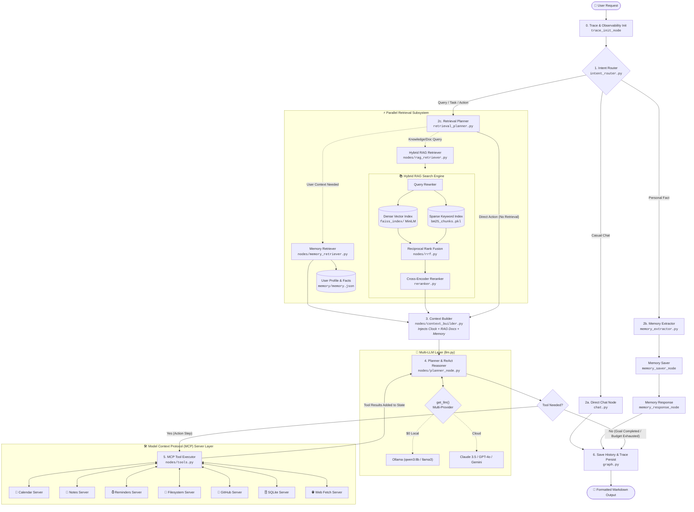

# Agentic AI Assistant (Production V1)

An enterprise-grade, local-first **Agentic AI Assistant** powered by LangGraph, small open-weights models (`Qwen3:8b` via Ollama), multi-provider cloud support (Claude, GPT-4o, Gemini, Groq), a **Production Hybrid RAG Engine**, and the **Model Context Protocol (MCP)**.

Built with **deterministic goal fulfillment guards**, **result-aware replanning**, **Reciprocal Rank Fusion (RRF)**, **cross-encoder reranking**, and **sandboxed tool isolation**.

---

## 🏛️ System Architecture



---

## 🚀 Key Capabilities

- **100% Free & Local by Default**: Runs on local Ollama (`qwen3:8b`) with zero cloud cost or API keys required.
- **1-Line Cloud Model Switching**: Seamlessly switch providers in `.env` (`anthropic`, `openai`, `google`, `groq`, `ollama`).
- **Production Hybrid RAG Engine**:
  - **Dense FAISS Vector Search** (`all-MiniLM-L6-v2`) for semantic concepts.
  - **Sparse BM25 Keyword Search** for exact terminology, codes, and numbers.
  - **Reciprocal Rank Fusion (RRF)** + **Cross-Encoder Reranking** (`ms-marco-MiniLM-L-6-v2`) for pinpoint precision.
- **7 Integrated MCP Servers**:
  - `calendar`: Event scheduling, listing, and updates.
  - `notes`: Rich note taking, searching, and management.
  - `reminders`: Task tracking and reminder management.
  - `filesystem`: Sandboxed file operations strictly restricted to `mcp_sandbox/`.
  - `github`: Issue management and repository search.
  - `sqlite`: Database schema discovery and SQL queries.
  - `fetch`: Safe web content fetching.
- **Enterprise Safety & Guardrails**:
  - **Human Confirmation**: Destructive actions (`delete`, `drop`) require explicit human approval.
  - **Goal Fulfillment Guard**: Ensures multi-step compound goals are not prematurely terminated.
  - **Loop Detection & Execution Budget**: Prevents infinite loops with strict circuit breakers.
  - **Observability**: Structured JSONL tracing in `traces/` with step-level latency breakdowns.

---

## 🛠️ Quickstart Guide

### 1. Prerequisites
- Python 3.10+ (tested on Python 3.12)
- [Ollama](https://ollama.ai) installed and running locally

### 2. Pull the Local Model
```bash
ollama pull qwen3:8b
```

### 3. Setup Virtual Environment
```bash
git clone https://github.com/Vasukumar19/agentic-ai-assistant.git
cd agentic-ai-assistant
python -m venv .venv
# Windows:
.\.venv\Scripts\Activate.ps1
# macOS/Linux:
source .venv/bin/activate

pip install -r requirements.txt
```

### 4. Configure Environment
```bash
cp .env.example .env
```

### 5. Ingest Knowledge Base (Optional / First Run)
```bash
python ingest.py
```

---

## 💻 Running the Assistant

### Interactive Chat Mode
```bash
python main.py
```

### Single Query Mode
```bash
python main.py "What is our company remote work policy?"
```

---

## 🧪 Testing & Verification

### 1. One-Command Production Smoke Test (< 15 seconds)
```bash
python scripts/smoke_test.py
```

### 2. Full Unit & Integration Test Suite
```bash
python -m pytest tests/ -v
```

---

## 📂 Project Structure

```text
agentic-ai-assistant/
├── main.py                        # Main CLI entrypoint & interactive shell
├── graph.py                       # LangGraph StateGraph pipeline definition
├── llm.py                         # Multi-LLM provider factory (Ollama, Claude, OpenAI, Gemini)
├── config.py                      # Global production configuration
├── state.py                       # LangGraph AgentState TypedDict
├── ingest.py                      # Document ingestion pipeline (FAISS + BM25)
├── reranker.py                    # Cross-encoder reranker
│
├── documents/                     # Raw enterprise knowledge documents (.txt)
├── faiss_index/                   # Dense vector index (index.faiss, index.pkl)
├── bm25_chunks.pkl                # Sparse BM25 keyword index
│
├── nodes/                         # LangGraph execution nodes
│   ├── intent_router.py           # Intent routing (chat, memory, research)
│   ├── chat.py                    # Casual conversation handler
│   ├── memory_extractor.py        # Fact & preference extractor
│   ├── memory_retriever.py        # Profile & semantic memory retriever
│   ├── retrieval_planner.py       # Decides RAG vs memory vs tool paths
│   ├── rag_retriever.py           # Hybrid RAG search engine
│   ├── context_builder.py         # Real-time clock & context assembler
│   ├── planner_node.py            # ReAct planner with goal guards & repair
│   ├── tools.py                   # Tool execution & confirmation gating
│   ├── embeddings.py              # Dense vector embeddings
│   ├── bm25.py                    # Sparse BM25 search
│   └── rrf.py                     # Reciprocal Rank Fusion
│
├── mcp_layer/                     # Model Context Protocol registry & client
├── mcp_calendar_server.py         # Calendar MCP server
├── mcp_notes_server.py            # Notes MCP server
├── mcp_reminders_server.py        # Reminders MCP server
├── mcp_filesystem_server.py       # Sandboxed filesystem MCP server
├── mcp_github_server.py           # GitHub integration MCP server
├── mcp_sqlite_server.py           # SQLite database MCP server
├── mcp_fetch_server.py            # Web fetch MCP server
│
├── memory/                        # Long-term memory store
├── observability/                 # Tracing, retry, timeout & error handlers
├── planning/                      # Goal guard, schema validation & planners
├── scripts/                       # Production utilities (smoke_test.py, inspect_trace.py)
└── tests/                         # Production integration & security test suite
```

---

## License & Contributing
Maintained as a production-grade agentic AI assistant architecture. MIT Licensed.

