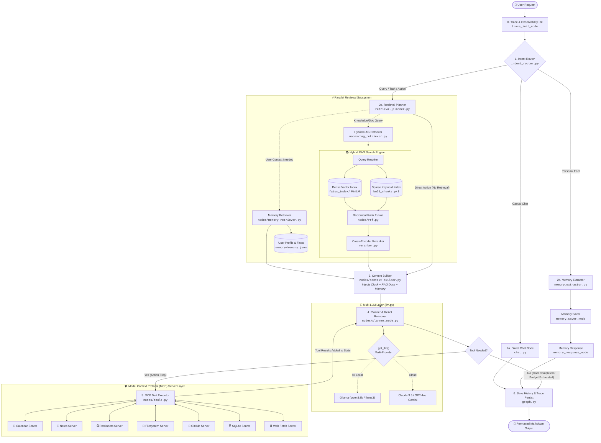

# Agentic AI Assistant — Production Architecture Specification

## 1. System Overview

The **Agentic AI Assistant** is an enterprise-grade agentic system designed for local-first edge execution using open-weights models (`Qwen3:8b` via Ollama) with seamless cloud failover/upgrades (Claude, GPT-4o, Gemini, Groq).

It unifies:
1. **LangGraph StateGraph** reactive reasoning loop.
2. **Hybrid RAG Pipeline** (Dense FAISS + Sparse BM25 + Reciprocal Rank Fusion + Cross-Encoder Reranking).
3. **Long-Term Memory & User Profiling** (Declarative facts + semantic retrieval).
4. **Model Context Protocol (MCP)** multi-server tool abstraction across 7 servers.
5. **Deterministic Safety Guards** (Goal fulfillment verification, human-in-the-loop confirmation, sandbox boundary isolation).

---

## 2. Complete Architecture Topology

---

## 3. Core Subsystems

### A. State Management (`state.py`)
All execution state is centralized in `AgentState`:
- `question`, `route`, `answer`
- `completed_steps`, `current_step`, `tool_results`, `execution_status`
- `required_operations`, `completed_operations`, `remaining_operations`
- `retrieval_plan`, `retrieved_docs`, `profile_context`
- `trace_events`, `latency_breakdown`, `llm_usage`

### B. Hybrid RAG Subsystem
- **Dense Vector Search**: FAISS vector index using `sentence-transformers/all-MiniLM-L6-v2`.
- **Sparse Lexical Search**: BM25 keyword index over tokenized chunks.
- **Reciprocal Rank Fusion (RRF)**: Merges dense and sparse ranks with \(k=60\) constant.
- **Cross-Encoder Reranking**: `ms-marco-MiniLM-L-6-v2` computes query-document cross-attention relevance scores.

### C. Multi-LLM Layer (`llm.py`)
Unified `get_llm()` factory with plug-and-play provider switching:
- `ollama`: $0 local offline inference (`qwen3:8b`, `llama3`).
- `anthropic`: `claude-3-5-sonnet-20241022`.
- `openai`: `gpt-4o`.
- `google`: `gemini-1.5-pro` / `gemini-2.0-flash`.
- `groq`: Ultra-fast inference with `llama-3.3-70b-versatile`.

### D. Model Context Protocol (MCP) Registry (`mcp_layer/`)
- Unified dynamic discovery and dispatch for 7 MCP stdio servers.
- Parameter auto-healing and JSON schema validation.
- Sandboxed execution with subprocess crash protection.

### E. Deterministic Safety & Policy Engine
1. **Human-in-the-Loop Confirmation**: Destructive operations (`delete_*`, `drop_table`) strictly require human confirmation before execution.
2. **Filesystem Sandboxing**: All file I/O is restricted to `mcp_sandbox/` with path-traversal prevention (`../`).
3. **Loop Detection & Execution Budgets**: Signature-and-result alternating loop detection with a 10-step hard execution budget.
4. **Structured Tracing**: JSONL execution traces persisted in `traces/` with latency metrics.

